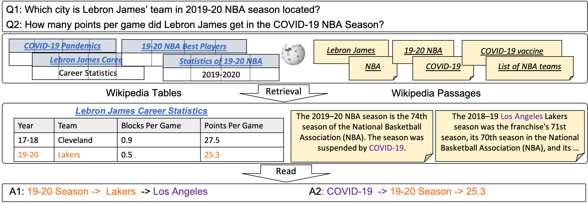

# Open Table-and-Text Question Answering (OTT-QA)

This respository contains the OTT-QA dataset used in [Open Question Answering over Tables and Text
](https://arxiv.org/abs/2010.10439) published in [ICLR2021](https://openreview.net/group?id=ICLR.cc/2021/Conference) and the baseline code for the dataset [OTT-QA](https://ott-qa.github.io/). This dataset contains open questions which require retrieving tables and text from the web to answer. This dataset is re-annotated from the previous HybridQA dataset. The dataset is collected by UCSB NLP group and issued under MIT license. You can browse the examples through our [explorer](https://ott-qa.github.io/explore.html).



What's new compared to [HybridQA](http://hybridqa.github.io/):
- The questions are de-contextualized to be standalone without relying on the given context to understand.
- We add new dev/test set questions the newly crawled tables, which removes the potential bias in table retrieval.
- The groundtruth table and passage are not given to the model, it needs to retrieve from 400K+ candidates of tables and 5M candidates of passages to find the evidence.
- The tables in OTT-QA do not have groundtruth hyperlinks, which simulates a more general scenario outside Wikipedia.

## Results
Table Retrieval: We use page title + page section title + table schema as the representation of a table for retrieval
|     Split     |     HITS@1    |     HITS@5     |     HITS@10       |   HITS@20         | 
|---------------|---------------|----------------|-------------------|-------------------|
|Dev            | 41.0%         | 61.8%          | 68.5%              | 73.7%             |

QA Results: We use the retrieved table + retrieved text as the evidence to run HYBRIDER model (See https://arxiv.org/pdf/2004.07347.pdf for details), the results are shown as:
|     Model     |     Dev-EM        |     Dev-F1 |
|---------------|---------------|----------------|
| BERT-based-uncased |  8.7     |     10.9       |
| [BERT-large-uncased](https://drive.google.com/file/d/1a3I2HaOIP_9wES53E5kjbb2ST5IbgrVQ/view?usp=sharing) | 10.9      | 13.1         |

## Repo Structure
- released_data: this folder contains the question/answer pairs for training, dev and test data.
- data/all_plain_tables.json: this file contains the 400K+ table candidates for the dev/test set.
- data/all_passages.json: this file contains the 5M+ open-domain passage candidates for the dev/test set.
- data/traindev_tables_tok: this folder contains the train/dev tables.
- data/traindev_request_tok: this folder cotains the linked passages for train/dev in-domain tables
- table_crawling/: the folder contains the table extraction steps from Wikipedia.
- retriever/: the folder contains the script to build sparse retriever index.

## Requirements
- [HuggingFace](https://github.com/huggingface/transformers)
- [Pytorch 1.4](https://pytorch.org/)
- [scipy](https://www.scipy.org/)

We suggest using virtual environment to install these dependencies.
```
conda install pytorch torchvision cudatoolkit=10.2 -c pytorch
pip install transformers
```

## Additional Information
If you want to know more about the crawling procedure, please refer to [crawling](https://github.com/wenhuchen/OpenHybridQA/tree/master/table_crawling) for details.

If you want to know more about the retrieval procedure, please refer to [retriever](https://github.com/wenhuchen/OpenDomainHybridQA/tree/master/retriever) for details.

Or you can skip these two steps to directly download the needed files from AWS in Step1.

## Step1: Preliminary Step
## Step1-1: Download the necessary files 
```
cd data/
wget https://opendomainhybridqa.s3-us-west-2.amazonaws.com/all_plain_tables.json
wget https://opendomainhybridqa.s3-us-west-2.amazonaws.com/all_passages.json
cd ../
```
This command will download the crawled tables and linked passages from Wikiepdia in a cleaned format.
## Step1-2: Build inedx for retriever
```
cd retriever/
python build_tfidf.py --build_option text_title --out_dir text_title_bm25 --option bm25
python build_tfidf.py --build_option title_sectitle_schema --out_dir title_sectitle_schema
```
This script will generate index files under retriever/ folder, which are used in the following experiments

## Step1-3: Reproducing the retrieval results
```
python evaluate_retriever.py --split dev --model retriever/title_sectitle_schema/index-tfidf-ngram\=2-hash\=16777216-tokenizer\=simple.npz  --format question_table
```
This script will produce the table retrieval results in terms of HITS@1,5,10,20,50.

## Step2: Training
### Step2-0: If you want to download the model from [Google Drive](https://drive.google.com/file/d/1a3I2HaOIP_9wES53E5kjbb2ST5IbgrVQ/view?usp=sharing), you can skip the following training procedure.
```
unzip models.zip
```
### Step2-1: Preprocess the training data
```
python retrieve_and_preprocess.py --split train
```
This command will generate training data for different submodules in the following steps.

### Step2-2: Train the three modules in the reader.
```
python train_stage12.py --do_lower_case --do_train --train_file preprocessed_data/stage1_training_data.json --learning_rate 2e-6 --option stage1 --num_train_epochs 3.0 --model_name_or_path bert-large-uncased
python train_stage12.py --do_lower_case --do_train --train_file preprocessed_data/stage2_training_data.json --learning_rate 5e-6 --option stage2 --num_train_epochs 3.0 --model_name_or_path bert-large-uncased
python train_stage3.py --do_train  --do_lower_case   --train_file preprocessed_data/stage3_training_data.json  --per_gpu_train_batch_size 12   --learning_rate 3e-5   --num_train_epochs 4.0   --max_seq_length 384   --doc_stride 128  --threads 8 --model_name_or_path bert-large-uncased
```
The three commands separately train the step1, step2 and step3 neural modules, all of them are based on BERT-uncased-base model from HugginFace implementation.

## Step3: Evaluation
### Step3-1: Reconstruct Hyperlinked Table using built text title index
```
python evaluate_retriever.py --format table_construction --model retriever/text_title_bm25/index-bm25-ngram\=2-hash\=16777216-tokenizer\=simple.npz
python retrieve_and_preprocess.py --split dev_retrieve --model retriever/title_sectitle_schema/index-tfidf-ngram\=2-hash\=16777216-tokenizer\=simple.npz
python retrieve_and_preprocess.py --split test_retrieve --model retriever/title_sectitle_schema/index-tfidf-ngram\=2-hash\=16777216-tokenizer\=simple.npz
```
This step can potentially take a long time since it matches each cell in the 400K tables against the whole passage title pool.

### Step3-2: Evaluate with the trained model
```
python train_stage12.py --stage1_model stage1/[YOUR-MODEL-FOLDER] --stage2_model stage2/[YOUR-MODEL-FOLDER] --do_lower_case --predict_file preprocessed_data/dev_inputs.json --do_eval --option stage12 --model_name_or_path bert-large-uncased --table_path data/all_constructed_tables.json --request_path data/all_passages.json
python train_stage3.py --model_name_or_path stage3/[YOUR-MODEL-FOLDER] --do_stage3   --do_lower_case  --predict_file predictions.intermediate.json --per_gpu_train_batch_size 12  --max_seq_length 384   --doc_stride 128 --threads 8 --request_path data/all_passages.json
```
Once you have generated the predictions.json file, you can use the following command to see the results.
```
python evaluate_script.py predictions.json released_data/dev_reference.json
```

## CodaLab Evaluation
To obtain the score on the test set (released_data/test.blind.json), you need to participate the CodaLab challenge in [OTT-QA Competition](https://competitions.codalab.org/competitions/27324). Please submit your results to obtain your testing score. The submitted file should first be named "test_answers.json" and then zipped. The required format of the submission file is described as follows:
```
[
  {
    "question_id": xxxxx,
    "pred": XXX
  },
  {
    "question_id": xxxxx,
    "pred": XXX
  }
]
```
The reported scores are EM and F1.

## Visualization
If you want to browse the tables, please go to [this website](https://wenhuchen.github.io/opendomaintables.github.io/) and type in your table_id like 'Serbia_at_the_European_Athletics_Championships_2', then you will see all the information related to the given table.
